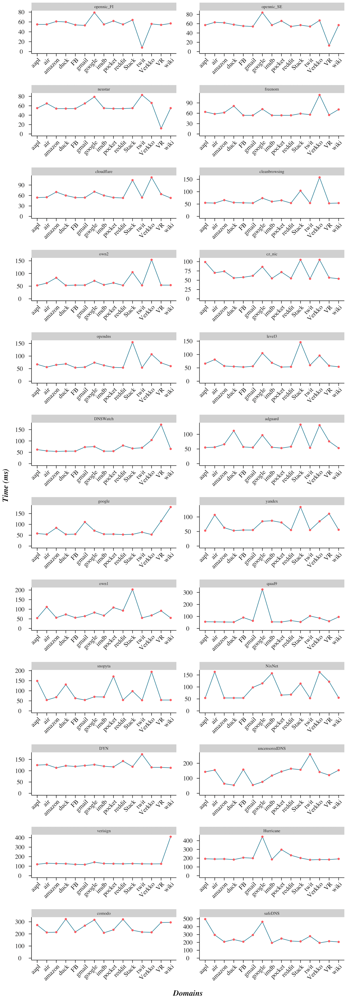

# DNS Speed Tester

This is an R script to test the speed (in milliseconds) of some of the public DNS resolvers from your Internet connection. Helps you choose a suitable DNS resolver should you wish to change from your ISPs DNS resolver.

These public DNS resolvers are checked by default (*Modify the script to add your preferred DNS resolvers*):
 * adguard - *176.103.130.132*
 * cleanbrowsing - *185.228.168.168*
 * cloudflare - *1.1.1.1*
 * comodo - *8.26.56.26*
 * DNSadvantage - *156.154.70.1*
 * DNSWatch - *84.200.69.80*
 * DYN - *216.146.35.35*
 * freenom - *80.80.80.80*
 * google - *8.8.8.8*
 * level3 - *4.2.2.1*
 * neustar - *156.154.70.3*
 * norton - *199.85.126.10*
 * opendns - 208.67.222.222
 * opennic - *176.126.70.119*
 * quad9 - *9.9.9.9*
 * safeDNS - *195.46.39.39*
 * verisign - *64.6.64.6*
 * yandex - *77.88.8.7*

# Dependencies 

You may need to install following for the script to work.

+ R [from CRAN](https://cran.r-project.org)
+ ```dig``` **D**omain **I**nformation **G**roper - [More on wikipedia](https://en.wikipedia.org/wiki/Dig_(command)). Dig is part of [bind](https://www.isc.org/downloads/bind/) package.
  + ```dig``` is pre-installed on MacOS but for linux system it can be installed using:

```sh
 $ sudo apt-get install dnsutils
```

# Usage

``` sh
 $ git clone https://github.com/dchakro/DNSSpeedTester.git
 $ cd DNSSpeedTester
 $ Rscript ./DNSSpeedTest.R
```

The script generates the data as a TSV (example below).

| DNS           | aapl   | air    | amazon | duck   | FB     | gmail  | google | imdb   | pocket | reddit | Stack  | twit   | Verkko | VR     | wiki   | avg      | sd   |
| ------------- | ------ | ------ | ------ | ------ | ------ | ------ | ------ | ------ | ------ | ------ | ------ | ------ | ------ | ------ | ------ | -------- | ---- |
| opennic_FI    | 55 ms  | 55 ms  | 61 ms  | 60 ms  | 54 ms  | 53 ms  | 79 ms  | 55 ms  | 62 ms  | 55 ms  | 64 ms  | 8 ms   | 56 ms  | 54 ms  | 57 ms  | 55.2 ms  | 14.6 |
| opennic_SE    | 57 ms  | 63 ms  | 62 ms  | 58 ms  | 55 ms  | 54 ms  | 84 ms  | 57 ms  | 66 ms  | 54 ms  | 57 ms  | 54 ms  | 67 ms  | 13 ms  | 57 ms  | 57.2 ms  | 14.5 |
| neustar       | 55 ms  | 65 ms  | 54 ms  | 54 ms  | 54 ms  | 65 ms  | 79 ms  | 55 ms  | 54 ms  | 54 ms  | 55 ms  | 83 ms  | 66 ms  | 12 ms  | 55 ms  | 57.3 ms  | 15.7 |
| freenom       | 64 ms  | 58 ms  | 62 ms  | 81 ms  | 54 ms  | 54 ms  | 72 ms  | 54 ms  | 54 ms  | 54 ms  | 59 ms  | 56 ms  | 113 ms | 55 ms  | 71 ms  | 64.1 ms  | 15.8 |
| cloudflare    | 54 ms  | 55 ms  | 70 ms  | 60 ms  | 54 ms  | 54 ms  | 71 ms  | 60 ms  | 54 ms  | 53 ms  | 104 ms | 54 ms  | 112 ms | 64 ms  | 53 ms  | 64.8 ms  | 18.6 |
| cleanbrowsing | 55 ms  | 54 ms  | 66 ms  | 56 ms  | 55 ms  | 54 ms  | 74 ms  | 60 ms  | 65 ms  | 54 ms  | 104 ms | 54 ms  | 158 ms | 53 ms  | 54 ms  | 67.7 ms  | 28.3 |
| own2          | 53 ms  | 62 ms  | 83 ms  | 53 ms  | 54 ms  | 54 ms  | 71 ms  | 55 ms  | 63 ms  | 53 ms  | 105 ms | 53 ms  | 154 ms | 54 ms  | 54 ms  | 68.1 ms  | 27.9 |
| cz_nic        | 99 ms  | 70 ms  | 74 ms  | 56 ms  | 58 ms  | 62 ms  | 86 ms  | 55 ms  | 72 ms  | 55 ms  | 105 ms | 54 ms  | 105 ms | 57 ms  | 54 ms  | 70.8 ms  | 19.1 |
| opendns       | 67 ms  | 56 ms  | 65 ms  | 69 ms  | 54 ms  | 56 ms  | 74 ms  | 63 ms  | 55 ms  | 54 ms  | 155 ms | 54 ms  | 107 ms | 73 ms  | 60 ms  | 70.8 ms  | 27   |
| level3        | 66 ms  | 81 ms  | 57 ms  | 55 ms  | 53 ms  | 56 ms  | 105 ms | 69 ms  | 53 ms  | 54 ms  | 146 ms | 60 ms  | 96 ms  | 58 ms  | 54 ms  | 70.9 ms  | 26.4 |
| DNSWatch      | 62 ms  | 56 ms  | 54 ms  | 55 ms  | 55 ms  | 73 ms  | 75 ms  | 55 ms  | 55 ms  | 80 ms  | 67 ms  | 70 ms  | 104 ms | 172 ms | 65 ms  | 73.2 ms  | 30.5 |
| adguard       | 55 ms  | 56 ms  | 66 ms  | 112 ms | 57 ms  | 55 ms  | 97 ms  | 56 ms  | 53 ms  | 58 ms  | 133 ms | 54 ms  | 131 ms | 76 ms  | 53 ms  | 74.1 ms  | 29.2 |
| google        | 58 ms  | 54 ms  | 84 ms  | 54 ms  | 55 ms  | 111 ms | 71 ms  | 55 ms  | 55 ms  | 53 ms  | 54 ms  | 64 ms  | 53 ms  | 115 ms | 180 ms | 74.4 ms  | 35.8 |
| yandex        | 53 ms  | 107 ms | 63 ms  | 53 ms  | 55 ms  | 55 ms  | 85 ms  | 87 ms  | 81 ms  | 55 ms  | 134 ms | 55 ms  | 85 ms  | 111 ms | 56 ms  | 75.7 ms  | 25.7 |
| own1          | 54 ms  | 112 ms | 56 ms  | 73 ms  | 56 ms  | 64 ms  | 83 ms  | 67 ms  | 109 ms | 93 ms  | 203 ms | 55 ms  | 68 ms  | 92 ms  | 55 ms  | 82.7 ms  | 38.6 |
| quad9         | 56 ms  | 55 ms  | 54 ms  | 53 ms  | 91 ms  | 64 ms  | 325 ms | 55 ms  | 54 ms  | 66 ms  | 54 ms  | 104 ms | 86 ms  | 60 ms  | 96 ms  | 84.9 ms  | 68.7 |
| snopyta       | 149 ms | 54 ms  | 68 ms  | 131 ms | 63 ms  | 54 ms  | 70 ms  | 69 ms  | 171 ms | 54 ms  | 98 ms  | 53 ms  | 194 ms | 54 ms  | 54 ms  | 89.1 ms  | 48.2 |
| NixNet        | 54 ms  | 163 ms | 54 ms  | 54 ms  | 54 ms  | 98 ms  | 115 ms | 157 ms | 66 ms  | 68 ms  | 114 ms | 53 ms  | 162 ms | 122 ms | 55 ms  | 92.6 ms  | 43.1 |
| DYN           | 125 ms | 127 ms | 113 ms | 122 ms | 119 ms | 123 ms | 127 ms | 120 ms | 117 ms | 143 ms | 118 ms | 173 ms | 115 ms | 115 ms | 113 ms | 124.7 ms | 15.4 |
| uncensoredDNS | 143 ms | 155 ms | 64 ms  | 54 ms  | 158 ms | 55 ms  | 76 ms  | 118 ms | 145 ms | 164 ms | 157 ms | 260 ms | 142 ms | 121 ms | 154 ms | 131.1 ms | 53.6 |
| verisign      | 120 ms | 131 ms | 128 ms | 126 ms | 119 ms | 117 ms | 142 ms | 128 ms | 126 ms | 125 ms | 127 ms | 125 ms | 124 ms | 125 ms | 410 ms | 144.9 ms | 73.6 |
| Hurricane     | 193 ms | 190 ms | 191 ms | 184 ms | 206 ms | 200 ms | 445 ms | 186 ms | 297 ms | 233 ms | 202 ms | 181 ms | 184 ms | 184 ms | 192 ms | 217.9 ms | 69.4 |
| comodo        | 273 ms | 212 ms | 214 ms | 322 ms | 216 ms | 268 ms | 316 ms | 209 ms | 234 ms | 320 ms | 230 ms | 215 ms | 213 ms | 294 ms | 295 ms | 255.4 ms | 44.4 |
| safeDNS       | 496 ms | 295 ms | 208 ms | 236 ms | 209 ms | 294 ms | 462 ms | 194 ms | 249 ms | 217 ms | 212 ms | 279 ms | 194 ms | 215 ms | 206 ms | 264.4 ms | 93.6 |


And a plot called `out.png` (example below):




+ TSV converted to Markdown table using this tool: https://github.com/donatj/CsvToMarkdownTable:
+ This project was inspired by [DNSperftest](https://github.com/cleanbrowsing/dnsperftest/) and was written in R from the ground up to query DNS resolvers using dig, then calculate the mean and standard deviation for the DNS queries, sort the output based on average response time and subsequently, write the output to a TSV file.  DNS Speed Test also includes more DNS resolvers and attempts to resolve the address three times.